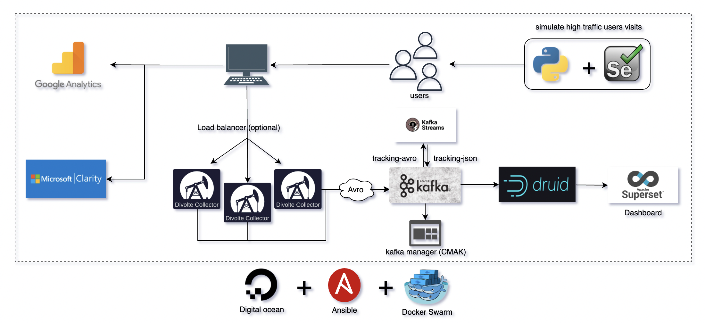
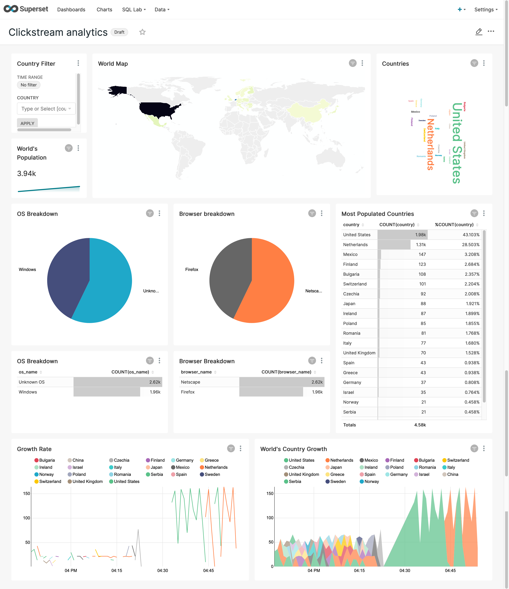
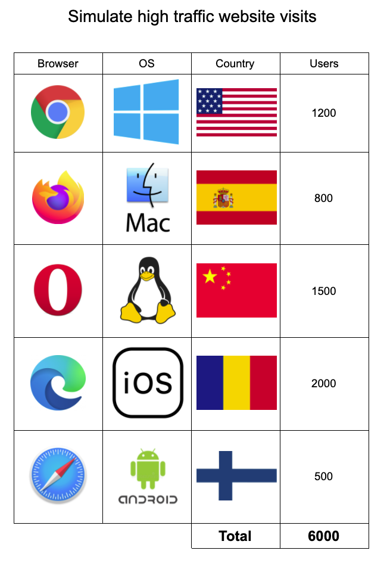

[](https://twitter.com/intent/follow?screen_name=odfsoufiane)

# Real-time Clickstream analysis

A proof of concept about collecting real-time clickstream data using Javascript, Divolte Collector, Apache Kafka, Kafka Streams, Apache Druid and Apache Superset.

At the end of the youtube video attached here, we are going to compare our results with Microsoft Clarity and Google Analytics. The comparison is going to be just for fun, as those platforms are complete products and built for years by big companies. 

# Youtube video

* [Real-time Clickstream Analysis](https://youtu.be/tvGMEkY7Ysw)

# Demo 
#### (this demo may not be available after some time, due to cloud infrastructure costs)

You can visit the website as a client, and then go to Apache superset dashboard to see real-time results.

Apache Superset dashboard credentials:
```
username: admin
password: admin
```

* Website: http://soufianeodf.tech
* Kafka Manager (CMAK): http://soufianeodf.tech:9000
* Apache Druid: http://soufianeodf.tech:8888
* Apache Superset: http://soufianeodf.tech:8080

# Architecture Diagram



# Dashboard



# Technologies Used

* A [tool](#disclosure) developed with [Selenium](https://www.selenium.dev/) and [Python](https://www.python.org/) (used for website user visits simulation)
* [Javascript](https://developer.mozilla.org/en-US/docs/Web/JavaScript) (used with [ipstack](https://ipstack.com/) tool to collect user information when visiting the website)
* [Divolte Collector](https://divolte.io/) (used as a server to collect clickstream data in Apache Kafka)
* [Apache Avro](https://avro.apache.org/) (used inside Divolte Collector as a schema for the payload)
* [Apache Kafka](https://kafka.apache.org/) (used as a publish/subscribe system)
* [Kafka Manager (CMAK)](https://github.com/yahoo/CMAK) (used as a dashboard manager of Apache Kafka cluster)
* [Kafka Streams](https://kafka.apache.org/documentation/streams/) (used to convert avro payload to json)
* [Apache Druid](https://druid.apache.org/) (used as a high performance real-time analytics database)
* [Apache Superset](https://superset.apache.org/) (used as a dashboard for data visualization)
* [Mapbox](https://www.mapbox.com/) (used in Apache Superset in order to use maps)
* [Docker](https://www.docker.com/) and [Swarm](https://docs.docker.com/engine/swarm/) (used for containerization and deployment)
* [Ansible](https://www.ansible.com/) (used to facilitate deployment on remote servers)
* [Digitalocean](https://www.digitalocean.com/) (used as a cloud infrastructure)

# Youtube videos I made on clickstream data collection

* [Divolte Collector for real-time clickstream](https://www.youtube.com/watch?v=lN_uZVAjXKQ&t=5s)
* [Divolte Collector with Apache Kafka for real-time clickstream](https://www.youtube.com/watch?v=6uha8gviL9A)

# Requirements

* Docker
* Ansible (if you want to automate the deployment on remote server)

# Getting Started

## Clone repository

```
git clone https://github.com/soufianeodf/youtube-divolte-kafka-druid-superset.git

cd youtube-divolte-kafka-druid-superset
```

## Website

* Add microsoft clarity and google analytics tags to the header of [index.html](website/website/index.html).
* Change the <code>divolte-ip-address</code> value by the ip-address or DNS of your divolte server in [index.html](website/website/index.html).
* You can change if you want the nginx config [file](website/nginx.conf).
* You can adapt the payload sent from [main.js](website/website/main.js).

## Divolte Collector

You can modify divolte-collector config files and adapt them to your needs:

* [divolte-collector.conf](divolte-collector/conf/divolte-collector.conf)
* [MyEventRecord.avsc](divolte-collector/conf/MyEventRecord.avsc)
* [mapping.groovy](divolte-collector/conf/mapping.groovy)

## Zookeeper, Apache Kafka and Kafka Manager

You can control all config variables of Zookeeper, Apache Kafka and Kafka Manager from [docker-compose.yml](docker-compose.yml).

## Kafka Streams

You can modify Kafka Streams variable from [application.properties](kafka-streams-avro-to-json/src/main/resources/application.properties) file.

Make sure that the avro [file](kafka-streams-avro-to-json/src/main/resources/MyEventRecord.avsc) is them same as the [one](divolte-collector/conf/MyEventRecord.avsc) you have in Divolte Collector server.

Don't forget to generate java .jar after you make any change.

## Apache Druid

You can modify the Apache Druid config [file](druid/common.runtime.properties) if you want.

After running Apache Druid, to filter payloads having null as country value, we use the following:

```
{
   "type":"not",
   "field":{
      "type":"selector",
      "dimension":"country",
      "value":null
   }
}
```

## Apache Superset

[superset.sh](superset/superset.sh) is the file responsible for setting the **username** and **password** of Apache Superset dashboard and more, make sure you execute it after Apache Superset is up and running.

In order for Apache Superset to use maps, it's using [Mapbox](https://www.mapbox.com/) under the hood, so for that, you need to set up the mapbox key in the config [file](superset/config.py):
```
MAPBOX_API_KEY = "you_mapbox_token"
```

After running Apache Superset, to connect to Apache Druid:

```
druid://<User>:<password>@<Host>:<Port-default-8888>/druid/v2/sql
```

## Docker

You need to build your images and push them to your docker hub repository, because docker swarm suppose that the images are already built and exists in a docker registry.

Adapt [docker-compose.yml](docker-compose.yml) to your needs, and then build and push the images to your docker hub repository as bellow:

```
docker-compose build
docker-compose push
```

## Deploy on DigitalOcean with Ansible

Ansible project is highly inspired from [pg3io/ansible-do-swarm](https://github.com/pg3io/ansible-do-swarm), shout-out to him.

The ansible [playbook](ansible/do-swarm.yml) is doing the following tasks:
* Create droplets in DigitalOcean.
* Install Docker on created droplets.
* Create cluster Docker Swarm with single manager.
* Copy [docker-compose.yml](docker-compose.yml) and [superset.sh](superset/superset.sh) files to manager node.
* Run Docker Swarm.
* Execute [superset.sh](superset/superset.sh).

### Playbook Variables 

All variables of the playbook can be found in [vars.yml](ansible/vars.yml)

***

* **do_token** : token Digital Ocean [link](https://docs.digitalocean.com/reference/api/create-personal-access-token/).
* **droplets** : list of droplets to deploy, first of the list will be the manager.
* **do_region** : datacenter location . Listing: curl -X GET --silent "https://api.digitalocean.com/v2/regions?per_page=999" -H "Authorization: Bearer <DO TOKEN>" |jq -r '{name: .regions[].name, regions_id: .regions[].slug}'
* **do_size** : droplet size. Listing: curl -X GET --silent "https://api.digitalocean.com/v2/sizes?per_page=999" -H "Authorization: Bearer <DO TOKEN>" |jq -r '.sizes[] .slug' | sort
* **ssh_key_ids** : register a ssh in your DigitalOcean account and then obtain its id with the following command: curl -X GET -H 'Content-Type: application/json' -H 'Authorization: Bearer '$DOTOKEN "https://api.digitalocean.com/v2/account/keys" 2>/dev/null |  jq  '.ssh_keys[] | {name: .name, id: .id}'

### Run

```
cd ansible/

ansible-playbook do-swarm.yml -e do_token="<DO TOKEN>"
```

## Troubleshooting

### Apache Superset

**Issue**: Unexpected Exception: name 'basestring' is not defined when invoking ansible2

**Solution**: <code>pip uninstall dopy</code> and <code>pip3 install git+https://github.com/eodgooch/dopy@0.4.0#egg=dopy </code>

**Issue**: The CSRF session token is missing

**Solution**: set up this property <code>WTF_CSRF_ENABLED = False</code> in config [file](superset/config.py)

# Website visits simulation with Selenium

In the video, I have simulated with a Selenium tool, visits to the website from different browsers, Operating systems and countries as described in the image bellow, to check if our clickstream solution we built is able to intercept those hits accurately:



# disclosure

The Selenium tool that simulate website user visits is private at this moment because it's still in the development phase, it will be public as soon as it's completed.

# License

Licensed under the [MIT License](LICENSE).
